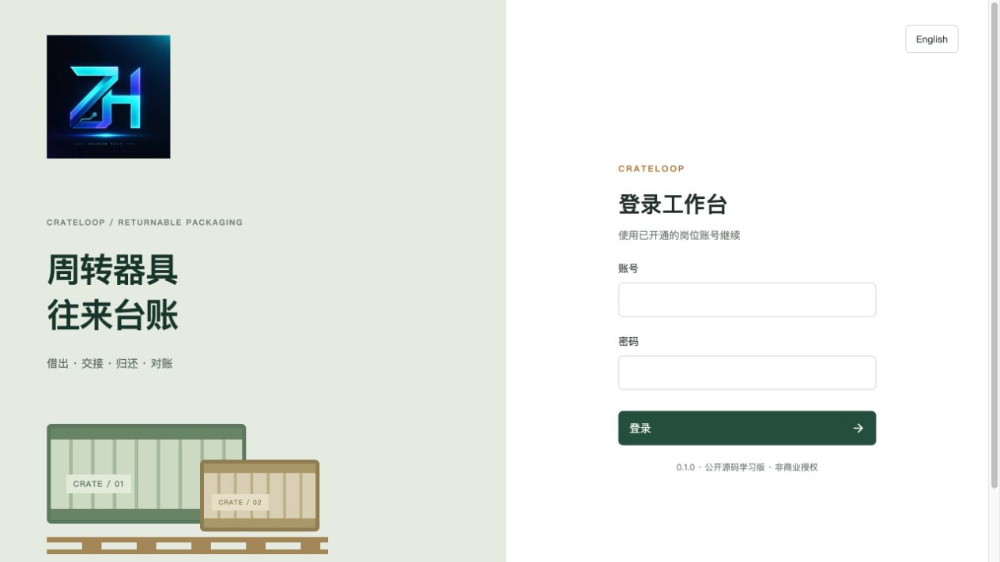
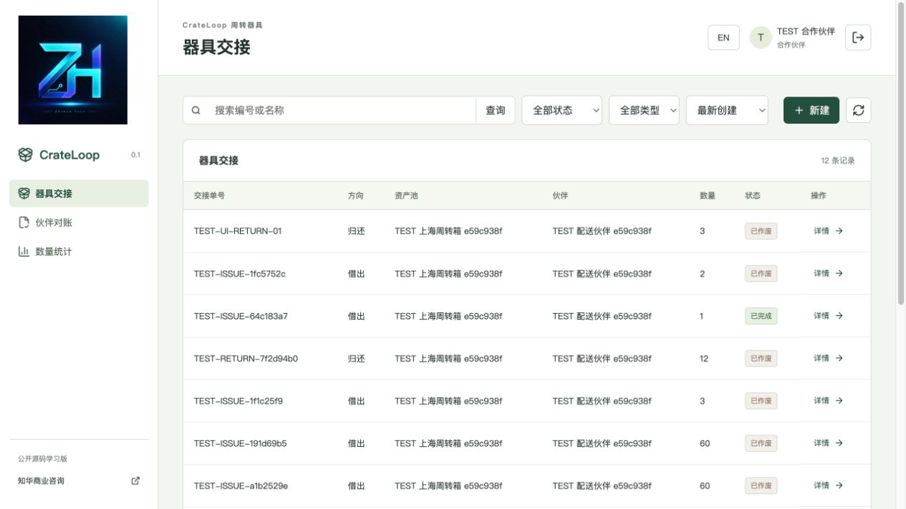
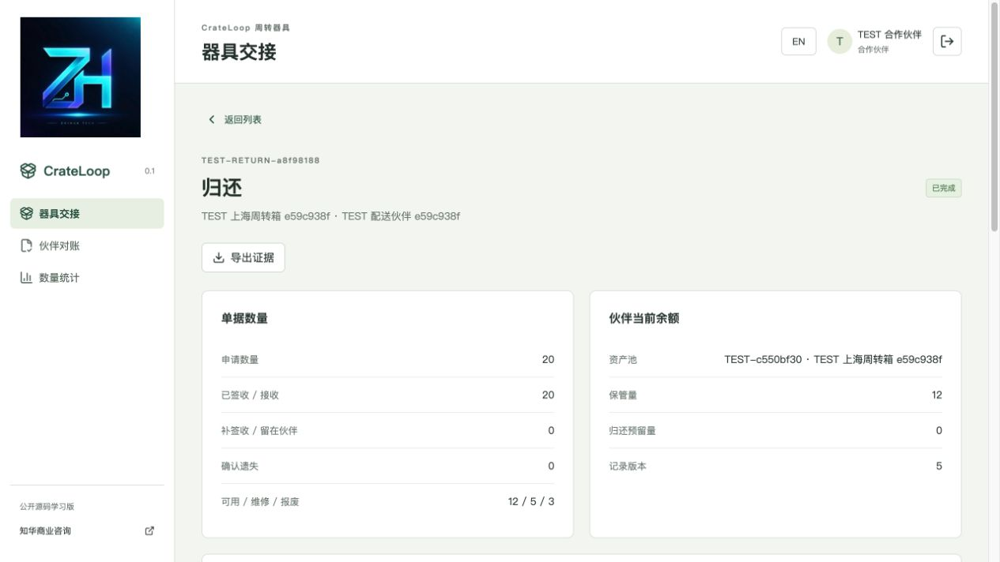
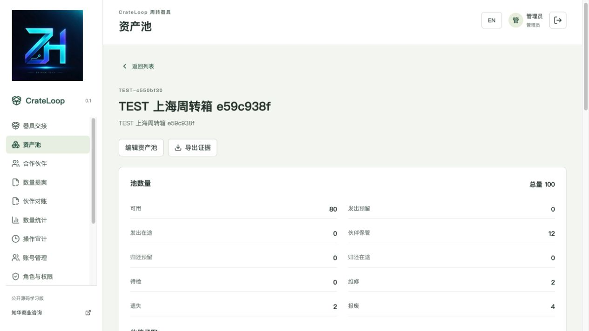
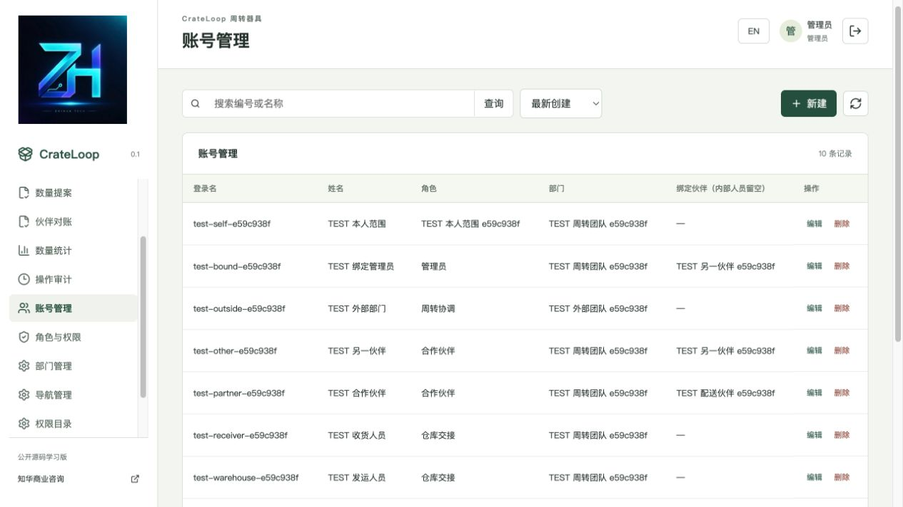
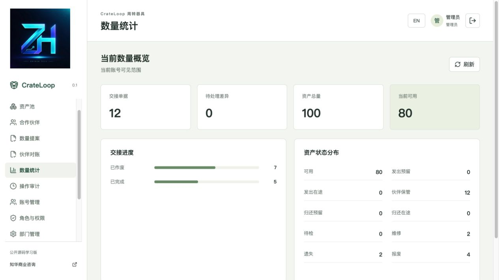
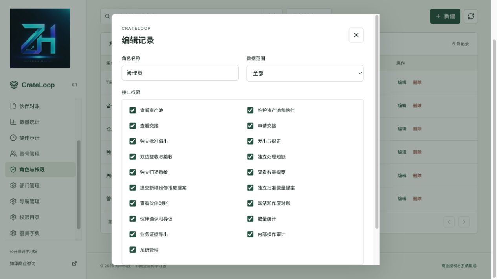
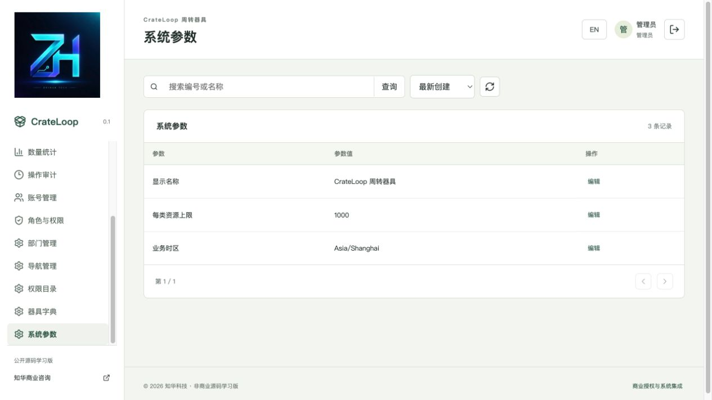

[中文](README.md) | [English](README.en.md)


# CrateLoop · 知华周转箱与托盘往来台账

知华科技（上海如静知华信息科技有限公司） · [官网](https://www.zhuatech.cn/) · 微信 zhuatech / zhuatech2。

**0.1.0 · 公开源码学习版／非商业源码版。未经书面授权不得商用。** 自有代码适用 [LICENSE](LICENSE)；第三方组件和素材保持其原有许可，见 [THIRD_PARTY_NOTICES.md](THIRD_PARTY_NOTICES.md)。

## 一只周转箱，从发出到回库

系统采用 Java 21／Spring Boot、Vue 3、MySQL 和 Flyway，提供数量守恒、伙伴数据隔离、器具交接与独立质检流程。

配送仓库、制造企业的周转协调人员，需要知道器具现在在哪个环节、由哪位伙伴保管，以及短缺有没有处理。CrateLoop 管理组织自有的**数量型、非逐件编号**周转箱、托盘和料箱。每个资产池归属一个部门和一种器具类型，每张交接单只对应一个池、一位伙伴和整数数量。

共享器具回收后检查、维修再投用的业务背景可参考 [CHEP 流程说明](https://www.chep.com/ca/en/node/150131)。CrateLoop 管理部署组织有权使用的自有器具，未对接任何器具运营商，也不提供租金、押金、赔偿定价或所有权认证。使用者须核实实际器具数量和单据证据。

### 数量如何闭合

```text
新增资产提案 → 独立批准 → 可用
借出申请 → 独立批准并预留 → 发出在途 → 伙伴签收 → 伙伴保管
归还申请 → 从保管量预留 → 提走在途 → 仓库接收 → 独立质检
                                                    ├→ 可用
                                                    ├→ 维修 → 独立批准维修分类 → 可用 / 报废
                                                    └→ 报废
在途短缺 → 独立复核凭据 → 补签收 / 仍在伙伴处 / 遗失
```

资产总量等于可用、发出预留、发出在途、伙伴保管、归还预留、归还在途、待检、维修、遗失和报废十种状态数量之和。遗失、报废保留在历史总量内，不从账上消失。伙伴子账与未完成交接单分别印证保管、预留、在途和待检量。每次过账都检查数量非负及这些等式，失败整笔回滚。

草稿不占器具；借出批准才预留。归还提交从对应伙伴保管量预留，不能把他人的器具归还。数量提案审批时重查余额，不预先锁定维修量。已经发运的交接不能作废，须按实际接收和短缺证据完成处理。停用池和伙伴禁止新借出，允许归还收回。

当前余额对账冻结伙伴子账及该池伙伴流水的截止编号，须无未完成实物交接。不同于制单人的授权人员确认；若冻结后新增相关流水，旧对账不能确认，须保留异议、作废并重建。对账不是财务结算，也不是任意历史日期的库存报表。

## 操作岗位与功能

| 模块 | 真实能力 |
| --- | --- |
| 器具交接 | 借出／归还草稿增改、提交、批准／驳回、预留、发运、实际签收、独立短缺处理、独立质检、未发运作废；编号搜索、状态与方向筛选、分页、排序 |
| 资产池与伙伴 | 零数量建池、类型字典、部门归属、版本化改名与启停；未引用目录可删除，有历史引用由外键保护 |
| 数量提案 | 新增资产、维修释放和可用器具报废，草稿增改、提交、独立批准／驳回、作废 |
| 伙伴对账 | 当前余额和完整往来流水快照、伙伴确认／异议、内部作废、变更截止点校验 |
| 证据与报表 | 追加数量流水和状态证据、范围内 JSON 业务证据下载，导出内容不加宣传文字 |
| 统计 | 当前账号可见交接状态、短缺量及池桶数量；伙伴只看自己的保管和归还预留余额 |
| 管理端 | 账号、角色、19 项注册权限、14 个注册菜单、部门、器具字典、系统参数、范围内操作审计 |
| 账号 | 会话登录、退出、修改本人密码、BCrypt 12 轮散列、CSRF、失败登录限速、实时权限与账号停用检查 |
| 页面 | 中文／英文切换、窄屏布局、搜索分页、详情、表单、错误与成功反馈、正式 LOGO 和咨询入口 |

初始角色是管理员、周转协调、独立复核、仓库交接、合作伙伴。协调建档和制单，复核独立审核及质检，仓库发运和接收，伙伴申请借出／归还、签收和确认对账。内部接收须与发运账号不同；审核须与制单账号不同；短缺复核须同时不同于制单、发运和接收账号；质检须与接收账号不同。可创建多个同岗位账号满足双人规则。

伙伴账号必须绑定同部门伙伴。绑定优先于角色的 ALL 范围，即使误分配管理员角色，也不能查看全池数量、其他伙伴单据或内部管理接口。内部人员支持 ALL、DEPARTMENT、SELF（本人创建）范围；隐藏菜单不代替接口权限。

### 实际运行页面

以下记录由隔离测试环境生成，所有业务名称以 TEST 标识，无真实客户数据。

| 登录 | 伙伴业务端首页 |
| --- | --- |
|  |  |

登录：会话认证。伙伴业务端：首页只显示本伙伴的保管和归还预留余额。

| 交接证据与数量 | 资产池与伙伴子账 |
| --- | --- |
|  |  |

交接详情：查看签收、短缺和质检证据。资产池：核对授权桶量与伙伴子账。

| 后台账号管理 | 数量统计 |
| --- | --- |
|  |  |

账号管理：维护部门、角色和伙伴绑定。数量统计：汇总当前授权范围的单据状态与器具数量。

| 角色权限 | 系统设置 |
| --- | --- |
|  |  |

角色权限：维护注册接口权限与数据范围。系统参数：配置工作空间名称和允许的资源容量。

## 部署与数据库

浏览器经同源 Nginx 访问 Spring Boot；JPA 持久化至 MySQL，Flyway 版本化建表。后端只校验结构，不自动改表；全局写事务锁、记录版本与 UUID 命令哈希一起保护状态和数量。完整规则见 [架构说明](docs/架构说明.md)。

| 部分 | 版本与约定 |
| --- | --- |
| 后端 | Java 21、Maven 3.9、Spring Boot 4.0.7、Spring Security、JPA、Flyway、MariaDB JDBC 驱动访问 MySQL |
| 前端 | Vue 3.5.40、Vite 8.1.5、Node 24.19.0、npm 11、Lucide 图标 |
| 数据库／代理 | MySQL 8.4、Nginx 1.29、Docker Compose v2 |
| 本地验收 | Python 3.10+；后端集成测试使用 H2 MySQL 模式，部署验收另外使用真实 MySQL |

```text
backend/                  API、领域服务、数量规则、身份和数据库迁移
  src/main/resources/db/migration/
  src/test/               数量单元及 HTTP/JPA 集成测试
frontend/                 Vue 页面、表单、权限按钮和前端测试
  public/brand/           原始 LOGO 与两张微信二维码
scripts/                  本地配置生成、真实 HTTP 验收、发布检查
docs/                     架构、部署、接口、操作、安全、截图和第三方许可
compose.yaml              隔离数据库、后端和前端
.env.example              配置名称；实际 .env 被忽略
```

### 一键启动

在项目根目录运行，需 Python 3.10+、Docker Desktop／Docker Engine 与 Compose v2，构建需连接依赖和官方镜像源：

```sh
python3 scripts/init-env.py
docker compose -p crateloop config --quiet
docker compose -p crateloop up -d --build --wait
```

配置生成器以权限 0600 建立 `.env`，不会覆盖已有配置。登录名是 `admin`，密码从**自己生成的 `.env` 的 ADMIN_PASSWORD** 获取。没有公开固定演示密码，也没有预置业务资产量。首次启动事务初始化总部、5 个角色、19 项权限、14 个菜单、3 种器具字典和3个系统参数；管理员密码散列由 BCrypt 写入数据库。业务示例由显式运行的隔离验收脚本建立。

- 前端与同源 API：[http://127.0.0.1:8127/](http://127.0.0.1:8127/)。
- 健康检查：[http://127.0.0.1:8127/actuator/health](http://127.0.0.1:8127/actuator/health)。
- MySQL 和后端端口不对宿主机发布。
- 覆盖冲突端口：`WEB_PORT=18127 docker compose -p crateloop up -d`，或修改自己 `.env` 的 WEB_PORT。

| 环境变量 | 含义 |
| --- | --- |
| DATABASE_PASSWORD / MYSQL_ROOT_PASSWORD | 应用与数据库管理员的独立密码，无弱默认值 |
| ADMIN_PASSWORD | 仅空库初始化管理员密码，至少12字符，含大小写字母和数字，UTF-8不超过72字节；后续改密码通过账号管理或本人密码入口 |
| WEB_PORT / BIND_ADDRESS | 默认8127／127.0.0.1；生产经可信反向代理与 HTTPS 访问 |
| COOKIE_SECURE | 本地 HTTP 为 false；HTTPS 部署设 true |
| DATABASE_URL / DATABASE_USER / DATABASE_CATALOG | 后端进程可覆盖 JDBC 地址、数据库账号及目录；Compose 默认使用容器内 MySQL，外部数据库接入需自行调整后端环境映射 |
| TEST_URL | 仅 HTTP 验收脚本，默认本地8127，可指向隔离恢复环境 |

### 本地开发与升级

Node 24.19.0/npm11；后端需 Java21/Maven3.9。前端 `cd frontend && npm ci && npm run dev`，Vite 将 `/api` 和健康请求代理到本地8080。后端在 `backend` 执行 `mvn spring-boot:run` 前，在终端设置 DATABASE_URL（`jdbc:mariadb://127.0.0.1:3306/zhuatech_crateloop`）、DATABASE_USER、DATABASE_PASSWORD、ADMIN_PASSWORD，开发 MySQL 用 Compose 持久卷启动并按需临时映射本地端口。不要连接生产数据库运行验收脚本。详见 [部署说明](docs/部署说明.md)。

迁移顺序是 `V1__identity.sql`（账号与系统目录）、`V2__reusable_pool.sql`（资产池、伙伴、交接、提案、流水、对账、命令和证据）。升级前备份数据库、记录当前版本并验证恢复；重新构建后启动后端，由 Flyway 校验并应用后续版本。不改写已执行迁移，不用删除数据卷解决升级问题。备份恢复命令见部署说明。

## 校验方法与安全边界

```sh
mvn -B -f backend/pom.xml spotless:check test package
cd frontend
npm ci
npm run format:check
npm run lint
npm test
npm run build
cd ..
docker compose -p crateloop config --quiet
git diff --check
python3 scripts/release-check.py
```

后端包括数量守恒单元和 HTTP/JPA 集成检查；前端检查权限动作、分类字段、整数传输及真实 CSRF 请求处理。Docker Maven 构建执行全部测试，不跳过。完整部署另用独立全新 MySQL 卷测试：

```sh
# 仅用于本项目隔离、可销毁的测试数据库，显式写入 TEST 业务与随机测试账号。
python3 scripts/smoke.py --allow-test-writes
# 界面操作后保存当前私有快照；output/ 被 Git 忽略。
python3 scripts/smoke.py --capture
# 重启或恢复数据库后比较所有业务、目录和权限响应。
python3 scripts/smoke.py --verify
```

业务检查包括借出、归还、短缺、维修和报废、预留作废、对账变更与异议、并发超额审批、精确 UUID 重试、旧版本、非整数拒绝、部门／本人／伙伴隔离、导出和账号撤销。截图核对、数据库迁移、容器健康、重启和独立恢复、实际验收凭证排除也须完成后再发布。

学习版默认每类主业务资源上限1000，可在 maxMovements 参数中调为100～1000；目录读取有界10000，列表每页最多100。采用单组织、全局串行写锁与应用内登录限速；未做大型并发性能、外部系统对接或高可用验收。未实现逐件序列号、扫描设备、RFID/GPS、租赁计费、支付、货品进销存、客户通知、文件上传及多租户。没有 AI／第三方账号必填配置或演示模式伪装的业务能力。

会话凭证不放浏览器持久存储；密码不返回接口、不写入业务证据；密码变更使旧会话失效。写接口需要 CSRF 和实时权限，数据库查询使用参数绑定；JSON 导出复用详情数据范围。生产使用 HTTPS、强密码、网络隔离、备份和最小权限，详见 [安全说明](SECURITY.md)。实际 `.env`、测试私有快照、备份和运行日志不要加入源代码版本。

| 常见问题 | 处理 |
| --- | --- |
| 首次健康等待失败 | 检查 `docker compose logs --tail=100 mysql backend`，核对配置、镜像源和数据库迁移；保留原卷 |
| 端口占用 | 覆盖 WEB_PORT，不停止其他项目 |
| 审批按钮不可用 | 核对岗位权限、状态和双人规则；伙伴绑定不会获得内部权限 |
| 数量不足／分类不匹配 | 核对当前余额、已预留量及实收量，不直接编辑数据库数量 |
| 对账不能确认 | 完成未结束交接；有新流水的冻结单作废重建 |
| 迁移校验失败 | 对照已发布迁移与数据库记录，恢复可信脚本并按新版本升级 |
| 修改 ADMIN_PASSWORD 后旧库登录不变 | 该变量仅初始化；用本人密码或管理员重置入口修改 |

## 使用、反馈与授权

日常操作见 [操作手册](docs/操作手册.md)，接口见 [接口说明](docs/接口说明.md)。贡献范围、验证步骤和问题反馈见 [CONTRIBUTING.md](CONTRIBUTING.md)。复现问题时只提供脱敏记录；安全漏洞通过 [安全反馈说明](SECURITY.md) 的官方咨询入口私下反馈，不在公开 Issue 上传凭证或客户数据。

源码仅供学习、研究和非商业交流，不能据此认定器具实际所在、财产权属、运输交付或财务责任。组织须自行核实台账证据、数据准确性、物理安全和部署配置。自有源码授权见 LICENSE，第三方许可独立适用。

## 授权说明

自有代码使用 [ZhuaTech Non-Commercial Source License 1.0](LICENSE)，仅限个人学习、技术研究与非商业交流。未经上海如静知华信息科技有限公司书面授权不得商用；企业私有化部署、收费交付与服务、SaaS 运营、转售及深度定制须另行授权。保留署名、官网、版权、许可证及授权联系方式；第三方依赖保持原许可。本项目属于“源码公开、非商业使用”，并非 OSI 标准开源许可，软件按现状提供，不宣称未经验证的生产可用性。

## 联系知华科技

本项目由知华科技（上海如静知华信息科技有限公司）提供公开源码学习版本，主要用于个人学习、技术研究与非商业交流。未经书面授权不得商用。企业信息化建设、中小企业数字化转型、中小企业 AI 转型、私有化部署、软件外包、软件项目外包、软件实施、FDE 外包、OPC 技术支持及深度定制开发，请访问知华科技官网 https://www.zhuatech.cn/，或添加微信 zhuatech、zhuatech2 咨询。

官网：[https://www.zhuatech.cn/](https://www.zhuatech.cn/)。商业授权、定制开发、部署与系统集成咨询微信：**zhuatech**、**zhuatech2**。

| 微信 zhuatech | 微信 zhuatech2 |
| --- | --- |
|  |  |

商业授权或深度定制开发请联系知华科技。
